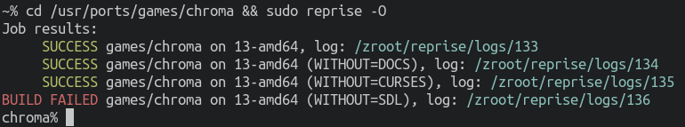

[](https://github.com/AMDmi3/reprise/actions/workflows/ci.yml)
[](https://github.com/AMDmi3/reprise)

# reprise



reprise is a tool primarily designed to test package production
on FreeBSD.

Its goals are to use modern facilities present in FreeBSD (such as
ZFS, jails), to be easy to use and to depend only on base.

Unlike [poudriere](https://github.com/freebsd/poudriere), it is
focused on port testing only, without support for repository
production, and has important features still lacking in poudriere,
such as `make test` support, and more eager use of prebuilt packages.
As a result, with reprise you test your ports, not rebuild llvm
and other heavy dependencies over and over again.

## Features against poudriere

- **Automatic jail management**
  Jails are automatically created on demand, no preparation steps
  are needed to run a build.
- **Automatic port trees management**
  No need to specify port trees explicitly, ports are tested in
  their native ports trees.
- **Any number of simultaneous runs**
  No `jail is already running` errors, any number of builds at
  once are possible.
- **Uses prebuilt packages eagerly**
  By default uses only prebuilt packages for all dependencies.
- **`make test` support**
  Running upstream unit and integration tests is crucial for providing
  high quality software through the Ports Tree, and this tool allows
  to do it without polluting the host system. It also properly supports
  `TEST_DEPENDS`, even when they create dependency loops.
- **Support for testing options combinations**
  It is possible to automatically test a lot of options combinations
  for a given ports.

## Drawbacks compared to poudriere

Most of these will hopefully be solved at some point.

- Not currently able to build and reuse packages, so dependencies
  which are set to be rebuilt are rebuilt for every run that need
  them.
- Not completely clean builds because of that: jail is polluted
  by build-time dependencies of many ports.
- No sanity checking (stage Q/A, shlibs and plist problem detection).
- No automatic rebuilds of dependencies.
- No support for workdir preservation.
- No support for custom `make.conf` injection.
- No support for manually setting options.

## Requirements

- Python 3.8+
- Python modules: `aiohttp`, `jsonslicer`, `termcolor`
- ZFS
- Root privileges

## Installation

Install from FreeBSD ports or packages:

```shell
cd /usr/ports/ports-mgmt/reprise && make install clean
```
```shell
pkg install reprise
```

...or run from the git checkout:

```shell
git clone https://github.com/AMDmi3/reprise
cd reprise
env PYTHONPATH=. python3 -m reprise.cli --help
```

## Quick start

Just run `reprise` in any port directory.

```shell
cd /usr/ports/category/port && reprise
```

It will create a ZFS dataset for itself, create a default jail by
fetching and extracting a tarball from FreeBSD https and run a test
of a given port in this jail. Try `-j`/`--jails` to run more jails,
`-O`/`--options` to test options combinations `-V`/`--vars` to pass
`make.conf` variables, `-d`/`--debug` for verbose logs and
`-n`/`--dry-run` to check what's it going to do without actual
building.

## Usage

### Configuration file

Some (see below) aspects of reprise may be configured through the
config file. It is searched in `~/.config/reprise/reprise.conf`
or (if reprise is installed from the Ports Collection) in
`/usr/local/etc/reprise/reprise.conf`, or may be specified explicitly
with the `-c` option.

### Specifying ports

Most common patter is to build/test a single port from the current
directory:

```shell
cd /usr/ports/category/port && reprise
```

You may also specify list of ports (in `category/port` format)
explicitly, on command line or through a file (one port per line,
whitespace ignored, #-comments supported). You may want to specify
path to ports tree as well, otherwise `/usr/ports` will be used.

```shell
reprise cat1/port1 cat2/port2                    # from /usr/ports
reprise -p /path/to/ports cat1/port1 cat2/port2
cat > portlist <<__END
cat1/port1
cat2/port2
# comments are ignored
_END
reprise -f portlist                              # from /usr/ports
reprise -p /path/to/ports -f portlist
```

### Specifying jails

By default, **reprise** generates a single jail with the same
architecture and system version as the host. You may override
this behavior and specify jails through the config, for example:

```yaml
jails:
  13-amd64: { version: 13.1-RELEASE, arch: amd64, tags: [13, amd64, default] }
  13-i386:  { version: 13.1-RELEASE, arch: i386,  tags: [13, i386 ] }
  12-amd64: { version: 12.3-RELEASE, arch: amd64, tags: [12, amd64] }
  12-i386:  { version: 12.3-RELEASE, arch: i386,  tags: [12, i386 ] }
```

Currently, only version/arch combinations available on
[download.freebsd.org](https://download.freebsd.org/releases/) are
supported.

You may select jails to use for the build with `-j`/`--jails`
argument, specifying any number of jail names or tags. If `-j` is
not specified, only jails with `default` tag are used (or all jails
if none of them has the tag). If `-j` is specified without an
argument, all jails are used.

Examples:

```shell
reprise cat1/port1                   # 13-amd64
reprise -j -- cat1/port1             # all four jails
reprise -j all -- cat1/port1         # the same
reprise -j 12-i386 13 -- cat1/port1  # 13-amd64, 13-i386, 12-i386
```

### Option combinations testing

When `-O`/`--options` flag is specified, **reprise** generates
a bunch of options combinations for each port and builds all of
these.

It is not possible to test all combinations as it would lead to
2^n variants to build, so generation is limited to a set of patterns:
- variant with each free option toggled
- for each GROUP, variant with each option toggled, and variants with
  all options in the group enabled and disabled
- each possible variant for for each SINGLE and RADIO group
- for MULTI group, variants with each option toggled, each single
  option variant and all options enabled variant

It's possible to limit the number of variants with `--excluded-options`
and `--included-options` options.

It's also possible to exclude default options combination (for instance,
if you've already tested it another way) with `--exclude-default-options`.

### Rebuilding dependencies

As mentioned **reprise** always uses prebuilt packages for dependencies.
In the case such package does not exist, a dependency is built in
the same jail. You may specify a list of ports to forcibly rebuild
the same way, for example when you want to test consumers of a
specific port.

```sh
reprise -r cat1/port-to-rebuild1 cat2/port2 -- target/port
```

Note that you need `--` to separate lists of ports.

### Networking isolation

Port are not allowed to access network during build. The same should
be true for testing, but is not on practice: a lot of tests require
socket and network operation. It's possible to control network
isolation for test with `--networking-test` option which
takes `DISABLED` (no network possible), `RESTRICTED` (only localhost)
or `UNRESTRICTED` (full network access) values. Currently it defaults
to `RESTRICTED`, but you may try different values for some ports.

```sh
reprise --networking-test UNRESTRICTED
```

### tmpfs support

It is possible to enable tmpfs independently for workdirs and
localbase, and it is possible to limit tmpfs size.

```sh
reprise --tmpfs-work --tmpfs-localbase --tmpfs-limit-mb 1024
```

## Author

  - [Dmitry Marakasov](https://github.com/AMDmi3) <amdmi3@amdmi3.ru>

## License

GPLv3 or later, see [COPYING](COPYING).
